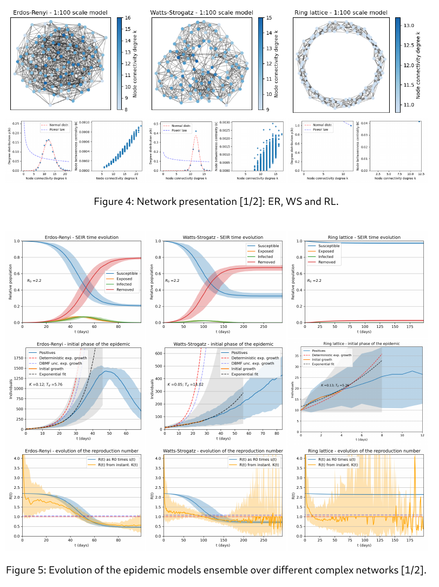

Pyndemic
------

A simple framework for epidemic simulations over networks, based on the _NetworkX_ and _NDlib_ libraries, with built-in ensemble capability, plotting and backup functions, inspired by the need to understand and overcome the ongoing COVID-19 pandemic.

`pyndemic.py` is the module that defines the specific classes and functions

`main.py` runs the simulations over 5 different network models

`lockdown.py` manages the sixth scenario with mitigation measures

`analysis.py` extracts key information and results and returns data tables

`plotAll.py` lauches all the plotting functions together

`ndlib_update.sh` automates the installation/update of the NDlib library

------

Inside the `tex/` folder there are the source codes for a 19-pages report describing some research done with the _pyndemic_ framework.

